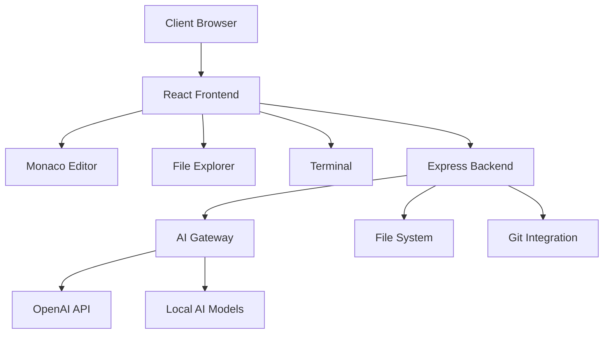

# 🚀 OqoolAI Cloud IDE - Advanced Development Environment

<div align="center">

[](https://github.com/oqoolai/cloud-editor)
[](https://opensource.org/licenses/MIT)
[](https://reactjs.org/)
[](https://www.typescriptlang.org/)
[](https://microsoft.github.io/monaco-editor/)
[](https://nodejs.org/)

**🌟 The Next-Generation Cloud IDE with AI Superpowers 🌟**

*Where Innovation Meets Intelligence - حيث يلتقي الإبداع بالذكاء الاصطناعي*

[🌐 Live Demo](https://demo.oqoolai.com) • [📖 Documentation](https://docs.oqoolai.com) • [💬 Discord](https://discord.gg/oqoolai) • [🐛 Report Bug](https://github.com/oqoolai/cloud-editor/issues)

</div>

---

## 📋 Table of Contents

- [🎯 Overview](#-overview)
- [✨ Key Features](#-key-features)
- [🏗️ Architecture](#️-architecture)
- [🚀 Quick Start](#-quick-start)
- [🔧 Installation](#-installation)
- [🎮 Usage Guide](#-usage-guide)
- [🛠️ Development](#️-development)
- [🤝 Contributing](#-contributing)
- [📝 License](#-license)

---

## 🎯 Overview

**OqoolAI Cloud IDE** is a cutting-edge, browser-based integrated development environment that combines the power of **Monaco Editor** (VS Code's editor), **AI-driven assistance**, and **real-time collaboration**. Built with modern web technologies, it provides a seamless coding experience that rivals desktop IDEs.

### 🌟 Why OqoolAI Cloud IDE?

- **🚀 Zero Setup**: Start coding instantly in your browser
- **🤖 AI-Powered**: Intelligent code generation and analysis
- **🔄 Real-time**: Live collaboration and instant feedback
- **🌍 Universal**: Works on any device with a web browser
- **⚡ Fast**: Lightning-fast performance with hot reload
- **🎨 Customizable**: Themes, layouts, and preferences

---

## ✨ Key Features

### 🖥️ **Advanced Code Editor**
- **Monaco Editor Integration** with full IntelliSense support
- **Multi-tab Interface** with smart file management
- **Syntax Highlighting** for 20+ programming languages
- **Code Folding** and advanced navigation
- **Live Error Detection** and auto-completion
- **Custom Themes** with dark/light mode support

### 🤖 **AI-Powered Development**
- **Code Generation**: Create components, functions, and entire modules
- **Intelligent Analysis**: Performance optimization suggestions
- **Smart Refactoring**: Automated code improvements
- **Bug Detection**: AI-powered error identification
- **Documentation**: Auto-generate comments and docs
- **Code Review**: Instant feedback and suggestions

### 🗂️ **Interactive File Explorer**
- **Tree View Navigation** with nested folder support
- **Smart File Icons** based on file types and extensions
- **Git Integration** with visual status indicators
- **Context Menu Actions**: Create, delete, rename, copy, paste
- **Search and Filter** capabilities
- **Drag & Drop** file operations (coming soon)

### 🖥️ **Enhanced Terminal**
- **Full-featured Terminal** with command history
- **Custom Commands** for project-specific operations
- **AI Command Suggestions** and auto-completion
- **Multi-session Support** (coming soon)
- **Integrated Build Tools** and task runners
- **Real-time Output** with color syntax highlighting

### 🎨 **Modern UI/UX**
- **Responsive Design** that works on all screen sizes
- **Split Layout System** with resizable panels
- **Customizable Workspace** with drag & drop layouts
- **Accessibility Support** with keyboard navigation
- **Progressive Web App** capabilities
- **Offline Mode** support (coming soon)

---

## 🏗️ Architecture

### 📊 System Overview



### 📁 Project Structure

```
oqoolai-cloud-ide/
├── 📁 packages/
│   ├── 📁 cli/                          # Command Line Interface
│   │   ├── 📁 src/                      # CLI source code
│   │   ├── 📁 bin/                      # Executable scripts
│   │   └── 📄 package.json              # CLI dependencies
│   │
│   ├── 📁 cloud-editor/                 # Main Cloud IDE
│   │   ├── 📁 frontend/                 # React Frontend
│   │   │   ├── 📁 src/
│   │   │   │   ├── 📄 App.tsx           # Main application
│   │   │   │   ├── 📁 components/       # React components
│   │   │   │   │   ├── 📄 Editor.tsx    # Monaco Editor wrapper
│   │   │   │   │   ├── 📄 FileTree.tsx  # File explorer
│   │   │   │   │   ├── 📄 Terminal.tsx  # Terminal component
│   │   │   │   │   └── 📄 SplitLayout.tsx # Layout manager
│   │   │   │   ├── 📄 styles.css        # Global styles
│   │   │   │   └── 📄 main.tsx         # Entry point
│   │   │   ├── 📄 package.json         # Frontend dependencies
│   │   │   ├── 📄 vite.config.ts       # Vite configuration
│   │   │   └── 📄 tsconfig.json        # TypeScript config
│   │   │
│   │   ├── 📁 backend/                  # Express Backend
│   │   │   ├── 📄 server.js             # Main server
│   │   │   ├── 📁 api/                  # API routes
│   │   │   │   ├── 📄 files.js          # File operations
│   │   │   │   ├── 📄 ai.js             # AI services
│   │   │   │   └── 📄 git.js            # Git operations
│   │   │   └── 📄 package.json          # Backend dependencies
│   │   │
│   │   └── 📄 README.md                 # Cloud IDE documentation
│   │
│   └── 📁 shared/                       # Shared utilities
│       ├── 📁 src/                      # Shared source code
│       ├── 📄 ai-gateway.ts             # AI service gateway
│       ├── 📄 utils.ts                  # Common utilities
│       └── 📄 package.json              # Shared dependencies
│
├── 📄 package.json                      # Root workspace config
├── 📄 README.md                         # This file
├── 📄 LICENSE                           # MIT license
└── 📄 .gitignore                        # Git ignore rules
```

### 🔧 Technology Stack

| Layer | Technology | Purpose |
|-------|------------|---------|
| **Frontend** | React 18.2.0 | User interface framework |
| | TypeScript 5.0.0 | Type-safe JavaScript |
| | Vite 4.5.0 | Build tool and dev server |
| | Monaco Editor 0.46.0 | Code editor engine |
| **Backend** | Express 4.18.0 | Web server framework |
| | Socket.IO 4.7.0 | Real-time communication |
| | Node.js 20.18.1 | JavaScript runtime |
| **Development** | ESLint | Code linting |
| | Prettier | Code formatting |
| | Concurrently | Parallel script execution |
| **Deployment** | Docker | Containerization |
| | Nginx | Reverse proxy |
| | PM2 | Process management |

---

## 🚀 Quick Start

### ⚡ One-Command Setup

```bash
# Clone and setup everything
git clone https://github.com/oqoolai/cloud-editor.git
cd cloud-editor
npm run install:all
npm run dev:cloud
```

### 🌐 Access the IDE

- **Frontend**: http://localhost:3000 (or next available port)
- **Backend API**: http://localhost:3001
- **Socket.IO**: ws://localhost:3001

---

## 🔧 Installation

### 📋 Prerequisites

- **Node.js** 18.0.0 or higher ([Download](https://nodejs.org/))
- **npm** 8.0.0 or higher (comes with Node.js)
- **Git** for version control ([Download](https://git-scm.com/))

### 🏗️ Step-by-Step Installation

#### 1. **Clone the Repository**
```bash
git clone https://github.com/oqoolai/cloud-editor.git
cd cloud-editor
```

#### 2. **Install Root Dependencies**
```bash
npm install
```

#### 3. **Install Workspace Dependencies**
```bash
npm run install:all
```

#### 4. **Setup Environment Variables**
```bash
# Create environment files
cp packages/cloud-editor/backend/.env.example packages/cloud-editor/backend/.env
cp packages/cloud-editor/frontend/.env.example packages/cloud-editor/frontend/.env

# Edit the files with your configuration
nano packages/cloud-editor/backend/.env
```

#### 5. **Start Development Servers**
```bash
# Start both frontend and backend concurrently
npm run dev:cloud

# Or start individually
npm run dev:backend    # Starts Express server on :3001
npm run dev:frontend   # Starts React dev server on :3000
```

### 🐳 Docker Setup (Alternative)

```bash
# Using Docker Compose
docker-compose up -d

# Or manual Docker build
docker build -t oqoolai-cloud-ide .
docker run -p 3000:3000 -p 3001:3001 oqoolai-cloud-ide
```

---

## 🎮 Usage Guide

### ⌨️ Keyboard Shortcuts

| Shortcut | Action | Description |
|----------|--------|-------------|
| `Ctrl+S` | Save File | Save current file |
| `Ctrl+N` | New File | Create new tab/file |
| `Ctrl+W` | Close Tab | Close current tab |
| `Ctrl+F` | Find | Search in current file |
| `Ctrl+J` | AI Assistant | Activate AI help |
| `Ctrl+Shift+P` | Command Palette | Show all commands |
| `Ctrl+` ` | Toggle Terminal | Show/hide terminal |
| `F11` | Fullscreen | Toggle fullscreen mode |

### 🖱️ Mouse Interactions

- **Single Click**: Select file/folder
- **Double Click**: Open file in editor
- **Right Click**: Context menu with actions
- **Drag & Drop**: Move files (coming soon)
- **Scroll**: Navigate through file tree/editor

### 🤖 AI Commands

The terminal supports special AI-powered commands:

```bash
# AI Assistant
ai "help me optimize this React component"
ai "explain this TypeScript error"
ai "suggest improvements for my code"

# Code Generation
generate component UserProfile
generate api users CRUD
generate test UserService

# Code Analysis
analyze src/components/
analyze --performance
analyze --security

# Code Optimization
optimize src/
optimize --bundle-size
optimize --performance
```

### 📁 File Operations

#### Creating Files and Folders
- Use the `+` button in the file tree header
- Right-click in file tree → "New File" or "New Folder"
- Terminal commands: `touch filename.tsx` or `mkdir foldername`

#### File Management
- **Rename**: Right-click → "Rename" or `F2`
- **Delete**: Right-click → "Delete" or `Delete` key
- **Copy/Cut**: Right-click → "Copy"/"Cut" or `Ctrl+C`/`Ctrl+X`
- **Paste**: Right-click → "Paste" or `Ctrl+V`

### ⚙️ Customization

#### Editor Settings
Access via the settings button ⚙️ in the editor toolbar:

- **Theme**: Dark, Light, High Contrast
- **Font Size**: 10px - 24px
- **Tab Size**: 2, 4, or 8 spaces
- **Word Wrap**: On/Off
- **Minimap**: Show/Hide
- **Line Numbers**: Show/Hide
- **Auto Save**: Enable/Disable

#### Workspace Layout
- **Split Panels**: Drag panel borders to resize
- **Hide/Show Panels**: Click panel headers to collapse
- **Reset Layout**: Use "View" → "Reset Layout"

---

## 🛠️ Development

### 🏃‍♂️ Development Scripts

```bash
# Development
npm run dev                 # Start all workspaces in dev mode
npm run dev:frontend        # Frontend only (React + Vite)
npm run dev:backend         # Backend only (Express + nodemon)
npm run dev:cli             # CLI development mode

# Building
npm run build               # Build all workspaces
npm run build:frontend      # Build React app for production
npm run build:backend       # Build Express app
npm run build:cli           # Build CLI tools

# Testing
npm run test                # Run all tests
npm run test:frontend       # Frontend tests (Jest + RTL)
npm run test:backend        # Backend tests (Jest)

# Linting & Formatting
npm run lint                # Lint all workspaces
npm run lint:fix            # Auto-fix linting issues
npm run format              # Format code with Prettier

# Maintenance
npm run clean               # Clean build artifacts
npm run upgrade:all         # Update all dependencies
npm run audit               # Security audit
```

### 🔧 Adding New Features

#### 1. **Frontend Components**
```bash
# Create new component
mkdir packages/cloud-editor/frontend/src/components/MyComponent
touch packages/cloud-editor/frontend/src/components/MyComponent/index.tsx
touch packages/cloud-editor/frontend/src/components/MyComponent/styles.css
```

#### 2. **Backend API Routes**
```bash
# Create new API route
touch packages/cloud-editor/backend/api/my-feature.js
```

#### 3. **Shared Utilities**
```bash
# Add to shared package
touch packages/shared/src/my-utility.ts
```

### 🧪 Testing Strategy

#### Frontend Testing
- **Unit Tests**: Jest + React Testing Library
- **Integration Tests**: Cypress or Playwright
- **Visual Tests**: Storybook + Chromatic

#### Backend Testing
- **API Tests**: Jest + Supertest
- **Integration Tests**: Test database interactions
- **Load Tests**: Artillery or K6

#### E2E Testing
- **User Workflows**: Complete user journey tests
- **Cross-browser**: Chrome, Firefox, Safari, Edge
- **Mobile**: Responsive design testing

---

## 🚀 Deployment

### 🌐 Production Build

```bash
# Build for production
npm run build:cloud

# The built files will be in:
# - Frontend: packages/cloud-editor/frontend/dist/
# - Backend: packages/cloud-editor/backend/dist/
```

### 🐳 Docker Deployment

```bash
# Build Docker image
docker build -t oqoolai-cloud-ide:latest .

# Run container
docker run -d \
  --name oqoolai-ide \
  -p 80:3000 \
  -p 3001:3001 \
  -e NODE_ENV=production \
  oqoolai-cloud-ide:latest
```

### ☁️ Cloud Deployment

#### Vercel (Recommended for Frontend)
```bash
npm install -g vercel
cd packages/cloud-editor/frontend
vercel --prod
```

#### Railway (Recommended for Backend)
```bash
npm install -g @railway/cli
cd packages/cloud-editor/backend
railway deploy
```

#### AWS EC2 / DigitalOcean
```bash
# Using PM2 process manager
npm install -g pm2
pm2 start ecosystem.config.js
pm2 startup
pm2 save
```

---

## 🤝 Contributing

We welcome contributions from the community! Please read our [Contributing Guide](CONTRIBUTING.md) for details.

### 🌟 Ways to Contribute

- 🐛 **Bug Reports**: Found a bug? [Create an issue](https://github.com/oqoolai/cloud-editor/issues)
- 💡 **Feature Requests**: Have an idea? [Start a discussion](https://github.com/oqoolai/cloud-editor/discussions)
- 🔧 **Code Contributions**: Submit a pull request
- 📖 **Documentation**: Improve docs and examples
- 🌍 **Translations**: Help translate the interface
- 🎨 **Design**: Contribute UI/UX improvements

### 📋 Development Process

1. **Fork** the repository
2. **Create** a feature branch: `git checkout -b feature/amazing-feature`
3. **Commit** your changes: `git commit -m 'Add amazing feature'`
4. **Push** to the branch: `git push origin feature/amazing-feature`
5. **Open** a Pull Request

### 📝 Code Standards

- **TypeScript**: Strict mode enabled
- **ESLint**: Follow configured rules
- **Prettier**: Auto-formatting on save
- **Testing**: Minimum 80% coverage
- **Documentation**: Comment complex logic

---

## 📈 Roadmap

### 🎯 Version 2.1 (Q2 2024)
- [ ] **Git Integration**: Full Git workflow support
- [ ] **Code Execution**: Run code in sandboxed environments  
- [ ] **Plugin System**: Extensible architecture
- [ ] **Collaborative Editing**: Real-time multi-user editing
- [ ] **Mobile App**: Native mobile applications

### 🚀 Version 2.2 (Q3 2024)
- [ ] **AI Pair Programming**: Advanced AI coding assistant
- [ ] **Debugging Tools**: Integrated debugger
- [ ] **Testing Suite**: Built-in testing framework
- [ ] **Deployment Pipeline**: One-click deployments
- [ ] **Offline Support**: Progressive Web App features

### 🌟 Version 3.0 (Q4 2024)
- [ ] **Language Server Protocol**: Enhanced language support
- [ ] **Container Integration**: Docker/Kubernetes support
- [ ] **AI Model Training**: Custom AI model training
- [ ] **Enterprise Features**: Team management, SSO
- [ ] **Marketplace**: Extension and theme marketplace

---

## 🏆 Community & Support

### 💬 Get Help

- **📖 Documentation**: [docs.oqoolai.com](https://docs.oqoolai.com)
- **💬 Discord**: [Join our community](https://discord.gg/oqoolai)
- **🐛 Issues**: [GitHub Issues](https://github.com/oqoolai/cloud-editor/issues)
- **📧 Email**: support@oqoolai.com
- **🐦 Twitter**: [@oqoolai](https://twitter.com/oqoolai)

### 🌟 Showcase

Share your projects built with OqoolAI Cloud IDE:
- Tag us on social media with `#OqoolAI`
- Submit to our [Showcase Gallery](https://oqoolai.com/showcase)
- Write a blog post about your experience

---

## 📝 License

This project is licensed under the **MIT License** - see the [LICENSE](LICENSE) file for details.

```
MIT License

Copyright (c) 2024 OqoolAI Team

Permission is hereby granted, free of charge, to any person obtaining a copy
of this software and associated documentation files (the "Software"), to deal
in the Software without restriction, including without limitation the rights
to use, copy, modify, merge, publish, distribute, sublicense, and/or sell
copies of the Software...
```

---

## 🙏 Acknowledgments

Special thanks to the amazing open-source projects that make this possible:

- **[Monaco Editor](https://microsoft.github.io/monaco-editor/)** - The editor that powers VS Code
- **[React](https://reactjs.org/)** - A JavaScript library for building user interfaces  
- **[Vite](https://vitejs.dev/)** - Next generation frontend tooling
- **[Express](https://expressjs.com/)** - Fast, unopinionated, minimalist web framework
- **[Socket.IO](https://socket.io/)** - Real-time bidirectional event-based communication
- **[TypeScript](https://www.typescriptlang.org/)** - JavaScript with syntax for types

---

<div align="center">

**🚀 Ready to revolutionize your coding experience?**

[**🌟 Star this repo**](https://github.com/oqoolai/cloud-editor) • [**🚀 Try the demo**](https://demo.oqoolai.com) • [**💬 Join Discord**](https://discord.gg/oqoolai)

**Built with ❤️ by the OqoolAI Team**

*Where Innovation Meets Intelligence - حيث يلتقي الإبداع بالذكاء الاصطناعي*

</div>